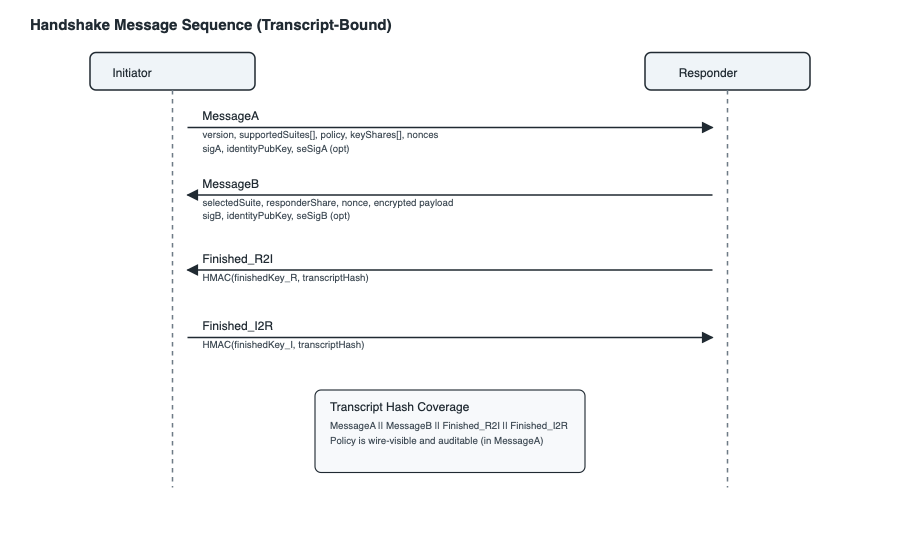

# SkyBridge Compass: A Crypto-Agile Peer-to-Peer Remote Desktop and File Transfer System with Post-Quantum Readiness on Apple Platforms

**Abstract—** Peer-to-peer remote desktop and file transfer systems increasingly operate across heterogeneous devices, untrusted networks, and long lifecycles in which cryptographic assumptions may expire faster than products. Yet “post-quantum readiness” is often treated as a one-off algorithm swap rather than a migration problem with downgrade resistance, auditability, and reproducibility requirements. This paper presents SkyBridge Compass, a crypto-agile P2P system that explicitly separates (i) negotiated cryptographic suites, (ii) platform-specific provider backends, and (iii) a policy layer that governs when (and whether) classic fallback is permissible. We introduce an actor-isolated handshake state machine with deterministic failure semantics and structured security-event emission, enabling end-to-end audit trails for downgrade, identity mismatch, and signature verification failures. We evaluate three configurations on macOS 26.x: classic (X25519 + Ed25519), PQC via liboqs (ML-KEM-768 + ML-DSA-65), and PQC via native CryptoKit (ML-KEM-768 + ML-DSA-65). End-to-end handshake completion latency (including event emission overhead) is 1.81 ms (p95 2.09 ms) for classic, 6.32 ms (p95 8.15 ms) for liboqs PQC, and 11.02 ms (p95 16.15 ms) for CryptoKit PQC over N=1000 iterations. The wire-format size grows from 819 B (classic) to 12,155 B (PQC), and we provide a conservative projection for a hybrid X-Wing-style exchange of approximately 12.4 KB. Beyond performance, we validate security-centric properties under fault injection and downgrade workloads, and we provide scripts and tests that reproduce all primary figures and tables from released artifacts.

**Index Terms—** post-quantum cryptography, crypto agility, downgrade resistance, secure handshake, peer-to-peer systems, remote desktop, Apple platforms, auditability, reproducibility.

---

## I. INTRODUCTION

Peer-to-peer (P2P) remote desktop and file transfer systems must establish secure sessions under adversarial network conditions, device churn, and multi-year lifecycles. These systems face a practical tension: users demand “it just works” pairing across heterogeneous stacks, while defenders require that cryptographic negotiation remains robust against downgrade and implementation-level failure modes. Post-quantum cryptography (PQC) increases this tension. Larger messages, higher computational cost, and uneven platform support make fallback tempting—yet fallback is exactly where silent downgrade and unverifiable behavior tend to hide.

Existing secure-channel designs and frameworks provide mature cryptographic building blocks, but they do not, by default, solve the migration problem an implementer actually faces: (i) selecting among classic/PQC/hybrid suites across platform strata, (ii) guaranteeing that policy (e.g., “require PQC”) is enforced at the entry points where callers cannot accidentally violate it, (iii) ensuring deterministic failure semantics under timeouts, reorder/duplication, and malformed inputs, and (iv) emitting security-relevant telemetry that can be audited without turning the system into a logging minefield. In practice, many systems either hard-code a single suite, or allow “compatibility” to creep into negotiation in ways that are hard to reason about and harder to verify.

This paper addresses these gaps with SkyBridge Compass, a crypto-agile P2P system designed for explicit PQC migration and auditability on Apple platforms. The core idea is to treat crypto agility as a layered contract: negotiated suites define the protocol surface; provider backends implement suites using platform-native or portable cryptography; and a policy layer governs fallback and produces structured evidence when (and only when) downgrade occurs. We complement this design with an actor-isolated handshake driver that enforces one-shot completion, timeouts, and sensitive-material zeroization, yielding deterministic outcomes even under adverse transport behaviors.

### A. Contributions

Contributions (reviewer-facing, evidence-backed):

1. We turn PQC migration from a narrative into an enforceable contract by making downgrade and legacy-compatibility decisions explicit, testable, and auditable rather than implicit “best-effort” fallback. (Fig. 7; Table XIII; PolicyDowngradeBenchTests, LegacyFallbackPreconditionTests)

2. We design a crypto-agile P2P handshake that cleanly separates suite negotiation, transcript binding, and protocol-signature keys, preventing “suite says PQC but keys stay classical” class of integration bugs. (Fig. 2; Table XIII; ProtocolSignatureRegressionTests, TranscriptIntegrityPropertyTests)

3. We provide migration safety with measurable coverage by enumerating legacy/PQC strata and validating acceptance/rejection boundaries under fault injection instead of relying on informal compatibility claims. (Table VIII; Table V; HandshakeFaultInjectionBenchTests)

4. We harden correctness under concurrency by an actor-isolated state machine with idempotent transitions and bounded retries, eliminating double-resume and state desynchronization failure modes. (Fig. 3; Table XIII; HandshakeDriverTests)

5. We make evaluation reproducible by shipping a benchmark harness that reports distributional statistics (p50/p95/p99) over large-N runs and links each metric back to a concrete failure taxonomy. (Fig. 6; Table I–II; HandshakeBenchmarkTests, MessageSizeSnapshotTests)

### B. Paper Organization

Section II reviews related work on P2P pairing, negotiation, and PQC migration. Section III details system architecture and protocol design. Section IV presents the handshake state machine. Section V presents the security model and guarantees. Section VI describes implementation details and platform instantiation. Section VII outlines evaluation methodology and metrics. Section VIII discusses limitations and future work, and Section IX concludes.

---

## II. RELATED WORK

### A. Peer-to-Peer Device Pairing

Device pairing protocols have evolved from simple PIN-based schemes to sophisticated cryptographic handshakes. Bluetooth Secure Simple Pairing (SSP) [2] introduced numeric comparison and passkey entry modes, but remains vulnerable to man-in-the-middle attacks during the initial exchange. Apple's Continuity protocols leverage iCloud identity for cross-device authentication [3], but require cloud connectivity and Apple ID enrollment.

PAKE (Password-Authenticated Key Exchange) protocols, particularly SPAKE2+ [4], enable secure pairing using low-entropy secrets without exposing them to offline dictionary attacks. PAKE-based pairing is considered as an alternative to our current PIN-comparison approach for the initial pairing ceremony; however, the pairing phase is out of scope of this paper's session handshake protocol. Our system uses visual PIN comparison during initial pairing while supporting hardware-backed key storage through Secure Enclave for subsequent sessions.

### B. Cryptographic Agility and Negotiation

The concept of cryptographic agility—designing systems to accommodate algorithm changes without architectural overhaul—has gained prominence as cryptographic standards evolve [5]. TLS 1.3 and QUIC exemplify suite negotiation and downgrade defenses by binding the selected parameters into signed transcripts or transport parameters [6], [18]. However, agility introduces complexity: systems must handle negotiation failures, prevent downgrade attacks, and maintain backward compatibility across heterogeneous peers.

Barker and Roginsky [7] provide NIST guidelines for transitioning to post-quantum algorithms, emphasizing hybrid approaches that combine classical and quantum-resistant primitives. Our CryptoProvider architecture directly implements these recommendations through its tiered selection mechanism.

### C. Handshake Frameworks and Noise-Style Patterns

Noise provides a compact framework for describing authenticated key exchange patterns with explicit transcript binding and identity key usage [19]. While SkyBridge Compass does not implement Noise directly, our MessageA/MessageB/Finished exchange mirrors the same security goals (authenticated key agreement with transcript coverage) and explicitly encodes policy for auditability. This helps position the protocol in a language familiar to the cryptography community without constraining the implementation to a fixed pattern family.

### D. Post-Quantum Cryptography Deployment

NIST's PQC standardization process culminated in the selection of CRYSTALS-Kyber (now ML-KEM) for key encapsulation and CRYSTALS-Dilithium (now ML-DSA) for digital signatures [8]. Early deployment experiences from Signal [9] and Cloudflare [10] highlight challenges in key size management and performance optimization.

Apple's announcement of PQC support in CryptoKit for macOS 26/iOS 26 represents a significant milestone for native platform integration. We treat Apple platforms as a deployable instance of a platform-agnostic design, emphasizing policy-driven migration rather than a platform-specific protocol.

### E. Secure State Machine Design

State machine vulnerabilities have been a persistent source of security bugs in protocol implementations [11]. Actor-based concurrency models, as implemented in Swift's actor system [12], provide compile-time guarantees against data races. We extend this model with explicit timeout handling and zeroization semantics to address the unique requirements of cryptographic handshakes.

---

## III. SYSTEM ARCHITECTURE

### A. Overview

SkyBridge Compass implements a layered architecture separating concerns across four primary domains: discovery, cryptographic operations, handshake management, and session transport. Fig. 1 illustrates the high-level component relationships and trust boundaries.

### A.1 Threat Model

We model an active network attacker in the Dolev-Yao style with the following **capability set**:

**Network Capabilities (Attacker-Controlled):**
- **Drop / delay / reorder / duplicate** packets on the discovery channel
- **Modify / inject** arbitrary bytes in MessageA/MessageB/Finished frames
- **Replay** prior handshake messages across sessions
- **Spoof capability or policy claims** to induce weaker negotiation
- **Force negotiation failure** by corrupting suites, key shares, or signatures

**Defense Mapping (Protocol + Policy):**
- **Transcript binding:** `sigB` covers MessageA and the chosen suite, so modifications to `supportedSuites[]`, `keyShares[]`, or `policy` fail verification.
- **Negotiation integrity:** Responder MUST select a suite that Initiator offered and for which a key share exists; otherwise reject `missingKeyShare`.
- **Replay control:** `handshakeId` is derived from nonces and cached to reject duplicates within a window.
- **Downgrade resistance:** timeout-triggered fallback is disallowed; only whitelisted errors may fallback under default policy; strictPQC forbids all fallback.
- **Rate limiting:** per-peer fallback cooldown prevents rapid downgrade cycling.
- **Legacy gating:** legacy P-256 acceptance requires an authenticated channel or an existing trust record.

**Trust Assumptions:**
1. The initial pairing ceremony occurs over a trusted out-of-band channel (e.g., visual PIN comparison on both device screens)
2. The device Keychain provides integrity guarantees for stored identity keys
3. The Secure Enclave (when available) provides hardware-backed key isolation that resists software-level extraction
4. Users can visually verify device identity during pairing (no blind trust)

**Out of Scope:**
- Side-channel attacks on cryptographic implementations
- Physical attacks on Secure Enclave hardware
- Compromise of the operating system kernel
- Social engineering attacks on users

### A.2 Protocol Message Flow

Fig. 2 illustrates the handshake message sequence and transcript coverage.



**Key Share Semantics:** The `keyShares[].shareBytes` field has suite-dependent interpretation:
- **DH suites (X25519):** `shareBytes` = ephemeral public key (32 bytes)
- **KEM suites (ML-KEM-768):** `shareBytes` = encapsulated key / ciphertext (`enc`, 1088 bytes)

This distinction matters: for DH, the Responder uses the Initiator's public key to compute a shared secret; for KEM, the Initiator has already encapsulated to the Responder's long-term KEM public key (obtained during pairing), and `shareBytes` carries the resulting `enc`. The Responder decapsulates using their private key.

**Nonce Freshness:** Each party contributes a 32-byte nonce (`clientNonce` in A, `serverNonce` in B). Both are bound into the KDF info parameter, ensuring symmetric freshness and enabling a unique session identifier:

```
handshakeId = SHA256(replayTag || initiatorNonce || responderNonce || suiteWireIdLE)
```

To prevent short-window replay attacks, implementations SHOULD cache recent `handshakeId` values (or the `(initiatorNonce, responderNonce)` pair) and reject duplicates within a configurable window (default: 5 minutes).

**Key Share Binding:** The `keyShares[]` array contains at most 2 entries (one PQC, one Classic) to bound message size while enabling negotiation. Each entry is a `(suiteId, shareBytes)` tuple. The Responder MUST select a suite for which the Initiator provided a key share; otherwise reject with `missingKeyShare`. This binds the negotiation to actual cryptographic material, preventing the "TLS key_share mismatch" class of bugs.

**Explicit Key Confirmation (Finished Frames):** Although the core key schedule is derived after MessageB, SkyBridge Compass performs an explicit key-confirmation exchange before entering the "established" state. The Responder sends a short `Finished_R2I` frame authenticated under the newly derived session keys; the Initiator verifies it and replies with `Finished_I2R`. A session is considered established only after both Finished frames are verified. This provides mutual key confirmation, eliminates ambiguity about the establishment point, and reduces responder-side half-open state under failures. The Finished frames are fixed-size authenticated messages (38 bytes each: 4-byte magic, 1-byte version, 1-byte direction, 32-byte HMAC) and add negligible wire overhead compared to PQC handshake payloads. The Finished MAC is computed as `HMAC-SHA256(finishedKey, transcriptHash)` where `finishedKey = HKDF(sessionKey, info="SkyBridge-FINISHED|<role>|")`. Wire overhead for the full handshake including Finished frames is reported in Table II.

**Anti-Downgrade Invariant:** The Initiator MUST verify that `selectedSuite` is a member of the `supportedSuites[]` it originally sent AND that `keyShares[]` contains an entry for `selectedSuite`. Since `sigB` commits to `MessageA` (via `transcriptA`), any modification to `supportedSuites[]` or `keyShares[]` by an attacker will cause `sigB` verification to fail.

**Suite Negotiation Scenarios:**

| Initiator supportedSuites | Responder Capability | Outcome | Notes |
|---------------------------|---------------------|---------|-------|
| [PQC, Classic] | PQC available | PQC established | Best available selected |
| [PQC, Classic] | Classic only | Classic established | Graceful fallback |
| [PQC only] | Classic only | Handshake failed | Policy enforced |
| [Classic only] | PQC available | Classic established | Initiator policy respected |

**Message Field Validation Rules:**

| Field | Validation | Failure Action |
|-------|------------|----------------|
| version | Must equal protocol version (1) | Reject with versionMismatch |
| supportedSuites | Must contain at least one suite supported by local implementation; unknown IDs are ignored for negotiation but still transcript-bound | Reject with suiteNegotiationFailed |
| keyShares | Unique suiteId per entry, max 2 entries, each shareBytes must match its suiteId's expected length | Reject with invalidMessageFormat |
| selectedSuite | Must be in supportedSuites AND have matching keyShare | Reject with missingKeyShare |
| clientNonce/serverNonce | Must be 32 bytes | Reject with invalidMessageFormat |
| sigA/sigB | Must verify against respective identityPubKey | Reject with signatureVerificationFailed |

**Canonical Encoding Rules:**
- `supportedSuites[]`: preference order, signed as-is (first = most preferred)
- `keyShares[]`: encoded in same order as `supportedSuites[]` (only suites with provided shares)
- All lists use 2-byte little-endian length prefix
- All integers use little-endian encoding
- Canonical encoding is byte-for-byte specified; implementations MUST NOT reserialize with language-native encoders (e.g., JSON, PropertyList) as this may introduce non-determinism

Note: The 32-byte `clientNonce`/`serverNonce` in message fields are distinct from the 12-byte `aeadNonce` used internally by AES-GCM for authenticated encryption.

**Failure Semantics:**
- All failures trigger `HandshakeContext.zeroize()` before error propagation
- Security events are emitted for audit logging
- No partial state is retained after failure

```
┌──────────────────────────────────────────────────────────────┐
│                    Application Layer                         │
│  ┌─────────────────┐  ┌─────────────────┐  ┌──────────────┐  │
│  │ Remote Desktop  │  │  File Transfer  │  │ Device Mgmt  │  │
│  └────────┬────────┘  └────────┬────────┘  └──────┬───────┘  │
└───────────┼────────────────────┼───────────────────┼─────────┘
            │                    │                   │
┌───────────┼────────────────────┼───────────────────┼─────────┐
│           ▼                    ▼                   ▼         │
│  ┌─────────────────────────────────────────────────────────┐ │
│  │                   Session Manager¹                      │ │
│  └─────────────────────────┬───────────────────────────────┘ │
│                            │                                 │
│  ┌─────────────────────────┼───────────────────────────────┐ │
│  │                         ▼                               │ │
│  │  ┌──────────────┐  ┌──────────────┐  ┌───────────────┐  │ │
│  │  │ Handshake    │  │CryptoProvider│  │ Transport     │  │ │
│  │  │ Driver       │<─┤ Factory      │  │ Service       │  │ │
│  │  └──────┬───────┘  └──────┬───────┘  └───────────────┘  │ │
│  │         │                 │                             │ │
│  │         ▼                 ▼                             │ │
│  │  ┌──────────────┐  ┌──────────────────────────────────┐ │ │
│  │  │ Handshake    │  │        Provider Implementations  │ │ │
│  │  │ Context      │  │  ┌────────┐ ┌────────┐ ┌───────┐ │ │ │
│  │  │ (Actor)      │  │  │Apple   │ │ OQS    │ │Classic│ │ │ │
│  │  └──────────────┘  │  │PQC     │ │ PQC    │ │       │ │ │ │
│  │                    │  └────────┘ └────────┘ └───────┘ │ │ │
│  │                    └──────────────────────────────────┘ │ │
│  │                         P2P Core Layer                  │ │
│  └─────────────────────────────────────────────────────────┘ │
│                         Core Module²                         │
└──────────────────────────────────────────────────────────────┘

¹ Implementation: iOSP2PSessionManager
² Implementation: SkyBridgeCore module
```


### B. CryptoProvider Protocol

The CryptoProvider protocol defines a unified interface for all cryptographic operations required by the handshake and session layers. This abstraction enables transparent substitution of underlying implementations without modifying caller code.

```swift
public protocol CryptoProvider: Sendable {
    var providerName: String { get }
    var tier: CryptoTier { get }
    var activeSuite: CryptoSuite { get }
    
    func kemDemSeal(plaintext: Data, recipientPublicKey: Data, 
                    info: Data) async throws -> KemDemSealedBox
    func kemDemOpen(sealedBox: KemDemSealedBox, privateKey: Data, 
                    info: Data) async throws -> Data
    func sign(data: Data, using key: SigningKeyHandle) async throws -> Data
    func verify(data: Data, signature: Data, 
                publicKey: Data) async throws -> Bool
    func generateKeyPair(for usage: KeyUsage) async throws -> KeyPair
}

/// Abstraction for signing keys: software or hardware-backed
public enum SigningKeyHandle: Sendable {
    case softwareKey(Data)                    // Exportable private key bytes
    case secureEnclaveRef(SecKey)             // Hardware-backed, non-exportable
    case callback(any SigningCallback)        // Delegate to external signer
}
```

The `SigningKeyHandle` abstraction resolves the apparent conflict between "private key as Data" and "Secure Enclave keys never leave hardware." Software keys are one variant; hardware-backed keys use a reference or callback, ensuring the protocol interface does not assume exportability.

The protocol mandates `Sendable` conformance, ensuring thread-safe usage across Swift's structured concurrency model. Each provider exposes its tier classification (`nativePQC`, `liboqsPQC`, or `classic`) and active cipher suite, enabling runtime introspection for logging and policy enforcement.

### C. CryptoSuite Wire Format

A **suite** defines the complete tuple `(KEM, SIG, AEAD, KDF)`. Algorithm suite identifiers use a structured 16-bit wire format enabling forward compatibility:

| Range | Category | Suite Components | Examples |
|-------|----------|------------------|----------|
| 0x00xx | Hybrid PQC (preferred) | X-Wing KEM, ML-DSA-65, AES-256-GCM, HKDF-SHA256 | 0x0001 |
| 0x01xx | Pure PQC | ML-KEM-768, ML-DSA-65, AES-256-GCM, HKDF-SHA256 | 0x0101 |
| 0x10xx | Classic | X25519 DHKEM, Ed25519, AES-256-GCM, HKDF-SHA256 | 0x1001 |
| 0xF0xx | Experimental | Reserved for testing | - |

Note: X-Wing is a hybrid KEM combining X25519 + ML-KEM-768; it does not include a signature algorithm. The suite identifier specifies the full primitive set, with ML-DSA-65 as the *preferred* signature algorithm when available; the current implementation may fall back to classic signatures (Ed25519 / Secure Enclave P-256) for broader OS/toolchain compatibility while keeping PQC confidentiality.

Unknown suite identifiers are parsed as `unknown(wireId)` rather than causing parse failures, allowing older clients to gracefully reject unsupported suites during negotiation.

### D. Provider Factory and Selection

The `CryptoProviderFactory` implements deterministic provider selection based on runtime capability detection and policy configuration:

```swift
public enum CryptoProviderFactory {
    public enum SelectionPolicy: Sendable {
        case preferPQC      // Default: best available
        case requirePQC     // Fail if PQC unavailable
        case classicOnly    // Force classic algorithms
    }
    
    public static func make(
        policy: SelectionPolicy = .preferPQC,
        environment: any CryptoEnvironment = SystemCryptoEnvironment.system
    ) -> any CryptoProvider
}
```

The selection algorithm proceeds as follows:

1. **Capability Detection:** Query the environment for Apple PQC availability (macOS 26+) and liboqs presence.
2. **Policy Application:** Match detected capabilities against the requested policy.
3. **Provider Instantiation:** Create the appropriate provider instance.
4. **Event Emission:** Emit a `SecurityEvent` recording the selection decision.

For `preferPQC` policy, the precedence order is: ApplePQCProvider -> OQSPQCProvider -> ClassicProvider. The `requirePQC` policy returns an `UnavailablePQCProvider` that throws on all operations if no PQC implementation is available.

### E. KEM-DEM Authenticated Encryption Format

The sealed box structure encapsulates KEM-based authenticated encryption output with explicit DoS protection. Our construction follows the KEM-DEM (Key Encapsulation Mechanism + Data Encapsulation Mechanism) paradigm: KEM.Encapsulate() -> HKDF-SHA256 -> AES-256-GCM. We call this an "HPKE-inspired KEM-DEM envelope" to distinguish it from RFC 9180 HPKE [13], which includes additional features such as multiple modes (Base, PSK, Auth, AuthPSK), context exporters, and a more complex key schedule.

On Apple 26+ platforms, CryptoKit provides native HPKE with quantum-secure cipher suites including X-Wing (ML-KEM-768 + X25519) [14]. When available, implementations SHOULD use CryptoKit's HPKE API directly rather than this compatibility envelope.

**Security Goals:**
- PQC suites: ML-KEM provides IND-CCA2 KEM security (per FIPS 203)
- Classic suites: X25519 ephemeral-DH encapsulation (DHKEM-style); security relies on the X25519/Gap-DH assumption and HKDF key separation
- INT-CTXT and IND-CPA for the payload encryption: AES-256-GCM in v1 (compat KEM-DEM), and RFC 9180 HPKE AEAD in v2 (e.g., ChaCha20-Poly1305 in our classic provider)
- Key separation via HKDF with context-specific info parameters including role binding

**Not Covered (delegated to RFC 9180 HPKE on Apple 26+):**
- Sender authentication modes (Auth, AuthPSK)
- Incremental AEAD for streaming

**Used in our handshake (classic v2):**
- HPKE exporter for deriving the per-session shared secret with explicit context binding

**Format Versions:**

The implementation supports two sealed box formats:

**v1 (Compatibility KEM-DEM):** Used when native HPKE is unavailable. Explicit nonce and tag fields.

```
Header (17 bytes):
┌─────────┬───────────┬────────┬────────┐
│ magic   │ version   │ suite  │ flags  │
│ (4B)    │ (1B)      │ (2B)   │ (2B)   │
├─────────┼───────────┼────────┼────────┤
│ encLen  │ nonceLen  │ tagLen │ ctLen  │
│ (2B)    │ (1B)      │ (1B)   │ (4B)   │
└─────────┴───────────┴────────┴────────┘

Body (v1):
┌─────────────────┬───────┬────────────┬─────┐
│ encapsulatedKey │ nonce │ ciphertext │ tag │
│   (encLen)      │ (12B) │  (ctLen)   │(16B)│
└─────────────────┴───────┴────────────┴─────┘
```

**v2 (Native HPKE):** Used with CryptoKit HPKE. Nonce and tag are embedded in the AEAD output.

```
Header (17 bytes):
┌─────────┬───────────┬────────┬────────┐
│ magic   │ version   │ suite  │ flags  │
│ (4B)    │ (1B)      │ (2B)   │ (2B)   │
├─────────┼───────────┼────────┼────────┤
│ encLen  │ nonceLen  │ tagLen │ ctLen  │
│ (2B)    │ (0)       │ (0)    │ (4B)   │
└─────────┴───────────┴────────┴────────┘

Body (v2):
┌─────────────────┬────────────────────────────┐
│ encapsulatedKey │ ciphertext (AEAD output)   │
│   (encLen)      │ (ctLen, includes auth tag) │
└─────────────────┴────────────────────────────┘
```

**Version Detection:** Parsers distinguish v1 from v2 by checking `nonceLen` and `tagLen`:
- v1: `nonceLen = 12`, `tagLen = 16`
- v2: `nonceLen = 0`, `tagLen = 0` (AEAD details encapsulated by library)

Length limits enforce DoS protection:
- `encLen` <= 4096 bytes (sufficient for ML-KEM-768's 1088-byte ciphertext)
- v1: `nonceLen` = 12 bytes (AES-GCM fixed), `tagLen` = 16 bytes (AES-GCM fixed)
- v2: `nonceLen` = 0, `tagLen` = 0 (embedded in ciphertext)
- `ctLen` <= 64KB (handshake phase, pre-authentication) or 256KB (post-authentication)

Parsing uses overflow-safe arithmetic and validates each field before allocation.

---

## IV. HANDSHAKE STATE MACHINE

### A. Design Principles

The handshake subsystem addresses three critical requirements:

1. **Race Condition Prevention:** Concurrent message arrival and timeout expiration must not cause double-resume of continuations.
2. **Sensitive Material Protection:** Ephemeral private keys and shared secrets must be zeroized on all exit paths.
3. **Observability:** All state transitions and failures must emit structured events.

### B. Actor-Isolated Architecture

The `HandshakeDriver` actor manages handshake state with compile-time data race prevention:

```swift
public actor HandshakeDriver {
    private var state: HandshakeState = .idle
    private var pendingContinuation: CheckedContinuation<SessionKeys, Error>?
    private var timeoutTask: Task<Void, Never>?
    private var pendingResult: Result<SessionKeys, Error>?
    
    public func initiateHandshake(with peer: PeerIdentifier) 
        async throws -> SessionKeys
    public func handleMessage(_ data: Data, from peer: PeerIdentifier) async
    public func cancel() async
}
```

The `HandshakeContext` actor isolates sensitive cryptographic material:

```swift
public actor HandshakeContext {
    private var ephemeralPrivateKey: SecureBytes?
    private var transcriptHash: SecureBytes?
    private var isZeroized: Bool = false
    
    public func zeroize()
}
```

**Reentrancy Considerations.** Swift actors permit method re-entry at suspension points (`await`). While actor isolation prevents data races, it does not prevent interleaving of method executions. Our `HandshakeDriver` mitigates reentrancy risks through several mechanisms:

1. **Single convergence point:** The `finishOnce(with:)` method provides a single point for handshake completion. It guards `pendingContinuation` access and immediately sets the reference to `nil` after resume, preventing double-resume even if called concurrently from timeout and message handlers.

2. **Early result buffering:** The `pendingResult` property stores results that arrive before the continuation is established (e.g., if `MessageB` arrives before `withCheckedThrowingContinuation` captures the continuation).

3. **Timeout cancellation:** `timeoutTask` is cancelled in `finishOnce`, preventing the race between timeout expiration and successful message receipt.

4. **State advancement:** State transitions occur before `await` points where possible, reducing the window for interleaved operations.

**Acknowledged Limitation:** The `handleMessageB` method awaits `cryptoProvider` operations inside the actor. If a new message arrives during this await, the actor could theoretically process it before the current operation completes. We mitigate this structurally by:
- Advancing state to `.processingMessageB` before the await, causing subsequent messages to be rejected or queued
- Copying all necessary immutable inputs before the await point
- Validating a monotonic epoch counter after the await returns, ensuring the actor state has not been invalidated by concurrent operations
- Emitting security events for any unexpected state transitions

This approach provides structural guarantees against reentrancy hazards rather than relying on timing assumptions. A formal analysis using model checking is planned for future work.

### C. State Transitions

Fig. 3 illustrates the handshake state machine for both roles.


### D. Double-Resume Prevention

The `finishOnce` method provides a single convergence point for handshake completion:

```swift
private func finishOnce(with result: Result<SessionKeys, Error>) {
    // Cancel timeout
    timeoutTask?.cancel()
    timeoutTask = nil
    
    // Guard against double resume
    guard let continuation = pendingContinuation else {
        // MessageB arrived before continuation established
        pendingResult = result
        return
    }
    pendingContinuation = nil  // Immediately nil to prevent reuse
    
    switch result {
    case .success(let keys): continuation.resume(returning: keys)
    case .failure(let error): continuation.resume(throwing: error)
    }
}
```

This pattern handles the race between timeout expiration and message arrival by:
1. Canceling the timeout task on any completion
2. Guarding continuation access with immediate nil assignment
3. Buffering early results in `pendingResult` for late continuation establishment

### E. Secure Zeroization

Swift's standard `Data` and `Array` types use copy-on-write (COW) semantics, which can leave uncontrolled copies of sensitive material in memory. The `SecureBytes` class addresses this by using manual `UnsafeMutableRawPointer` allocation to maintain exclusive ownership of the memory region, preventing COW-induced secret proliferation.

```swift
public final class SecureBytes: @unchecked Sendable {
    private let pointer: UnsafeMutableRawPointer
    private let count: Int
    
    /// Injectable wiping function for test verification
    nonisolated(unsafe) public static var wipingFunction: 
        (UnsafeMutableRawPointer, Int) -> Void = secureZero
    
    deinit {
        if count > 0 {
            Self.wipingFunction(pointer, count)
        }
        pointer.deallocate()
    }
}
```

**Design Rationale:**

1. **Avoiding Copy-on-Write:** The primary motivation for `SecureBytes` is to prevent COW semantics from creating untracked copies of ephemeral keys and shared secrets. All sensitive material in `HandshakeContext` uses `SecureBytes` rather than `Data`.

2. **Explicit Zeroization on Failure Paths:** Because Swift's ARC does not guarantee `deinit` timing, all failure paths in `HandshakeDriver` explicitly call `context.zeroize()` before error propagation. The `deinit` zeroization serves as a defense-in-depth fallback, not the primary mechanism.

3. **Compiler Optimization Resistance:** On Darwin platforms, zeroization uses platform-supported secure wipe primitives where available, or `memset` followed by `withExtendedLifetime` as a fallback. We aim for best-effort zeroization; complete guarantees depend on compiler/runtime semantics and are not formally provable in Swift today.

4. **Test Verification:** The `wipingFunction` is a static property that can be replaced during testing. This enables verification that zeroization paths are exercised on all failure modes, as demonstrated in Section VII.B.1.

### F. Transcript Binding and Signature Separation

The protocol uses domain-separated signatures to prevent cross-message and cross-session replay attacks.

**Signature A (MessageA):** The Initiator signs only MessageA-local fields:

```swift
// preimageA: fields known to Initiator at MessageA time
let preimageA = Data()
    + DS("SkyBridge-A")                           // Domain separator
    + version.encoded
    + supportedSuites.canonicalEncode()           // Preference order preserved
    + keyShares.canonicalEncode()                 // Bound to supportedSuites order
    + clientNonce                                 // 32 bytes
    + capabilities.canonicalEncode()
    + policy.canonicalEncode()
    + identityPubKey_I

sigA = Sign(preimageA, identityPrivKey_I)

// Optional Secure Enclave binding (prevents SE proof replay)
seSigA = SE_Sign(DS("SkyBridge-SE-A") || SHA256(preimageA))
```

**Signature B (MessageB):** The Responder signs a transcript that commits to MessageA:

```swift
// transcriptA: hash of MessageA (excluding sigA and seSigA)
let transcriptA = SHA256(MessageA_without_signatures)

let preimageB = Data()
    + DS("SkyBridge-B")                           // Domain separator
    + transcriptA                                 // Commits to entire MessageA
    + selectedSuite.wireId.encoded
    + responderEphPubKey
    + serverNonce                                 // 32 bytes, fresh
    + SHA256(encryptedPayload)                    // Bind payload without bloating sig
    + identityPubKey_R

sigB = Sign(preimageB, identityPrivKey_R)

// Optional Secure Enclave binding
seSigB = SE_Sign(DS("SkyBridge-SE-B") || SHA256(preimageB))
```

**Key Derivation:** Nonces, transcripts, suite binding, and *directional separation* are included in the KDF, and the salt is transcript-bound (non-empty):

```swift
let kdfInfo = Data()
    + DS("SkyBridge-KDF")
    + selectedSuite.wireId.encodedLE
    + transcriptA
    + transcriptB                      // e.g., SHA256(MessageB_without_signatures)
    + clientNonce
    + serverNonce

// Transcript-bound salt (prevents cross-context reuse)
let salt = SHA256(DS("SkyBridge-KDF-Salt-v1|") || kdfInfo)

// Direction-based symmetric key derivation
// Both sides derive the same key for each direction:
// - initiator_to_responder: Initiator's sendKey = Responder's receiveKey
// - responder_to_initiator: Responder's sendKey = Initiator's receiveKey
let i2rInfo = kdfInfo + DS("handshake|initiator_to_responder")
let r2iInfo = kdfInfo + DS("handshake|responder_to_initiator")

// For Initiator: sendKey = I2R, receiveKey = R2I
// For Responder: sendKey = R2I, receiveKey = I2R
let sendKey = HKDF<SHA256>.deriveKey(
    inputKeyMaterial: sharedSecret,
    salt: salt,
    info: role == .initiator ? i2rInfo : r2iInfo,
    outputByteCount: 32
)

let receiveKey = HKDF<SHA256>.deriveKey(
    inputKeyMaterial: sharedSecret,
    salt: salt,
    info: role == .initiator ? r2iInfo : i2rInfo,
    outputByteCount: 32
)
```


This structure ensures: (1) `sigB` commits to `MessageA`, so any tampering breaks verification; (2) domain separators prevent cross-protocol attacks; (3) SE signatures are session-bound and non-replayable.

---

## V. SECURITY MODEL AND GUARANTEES

### A. Security Model

We assume an active network adversary with full control of the discovery channel (drop, delay, reorder, duplicate, modify, and inject messages) but without breaking standard cryptographic assumptions. The attacker can replay prior handshakes and attempt downgrade by suppressing PQC-related fields. We assume the out-of-band pairing ceremony is trusted and that device key storage (Keychain/Secure Enclave) preserves key integrity. The attacker may compromise a peer after pairing, but cannot retroactively forge signatures for past sessions.

### B. Security Goals and Proof Sketches

We state the core properties as invariants and provide non-formal proof sketches tied to protocol mechanics:

**Property G1 (Negotiation Integrity):** The selected suite must be among the Initiator’s offered suites and have a corresponding key share.  
*Proof sketch:* `MessageB` includes `selectedSuite`, and `sigB` covers `MessageA`; any modification to `supportedSuites[]` or `keyShares[]` breaks `sigB` verification. The Responder validates `selectedSuite in supportedSuites[]` and `keyShares[]` contains a matching entry.

**Property G2 (Mutual Authentication for Paired Peers):** For previously paired devices, the peer identity is authenticated and bound to the handshake transcript.  
*Proof sketch:* `identityPubKey` is pinned during OOB pairing. `MessageA`/`MessageB` signatures over transcript data must verify under the pinned key, otherwise `identityMismatch` aborts the handshake.

**Property G3 (Session Key Secrecy):** The derived session keys remain secret under standard KEM/DH and signature security assumptions.  
*Proof sketch:* The shared secret is derived from KEM decapsulation or DH, and keys are extracted via HKDF with transcript-bound salt; an attacker without the private key material cannot compute the shared secret or derive session keys.

**Property G4 (Replay Resistance):** Replayed handshakes do not establish a session.  
*Proof sketch:* `handshakeId` derives from fresh nonces and suite identifiers; replay detection caches recent IDs and rejects duplicates within the window.

**Property G5 (Downgrade Resistance under strictPQC):** No fallback to classic is allowed under strict policy.  
*Proof sketch:* `TwoAttemptHandshakeManager` enforces a policy gate before any fallback attempt; strictPQC forbids all fallback edges regardless of error type. This is validated by policy downgrade benchmarks (Fig. 6).

**Property G6 (Safe Fallback under default policy):** Fallback can only occur for a whitelisted set of benign errors, and never due to timeout.  
*Proof sketch:* A whitelist/blacklist of error causes controls fallback; `timeout` is explicitly blocked and per-peer cooldown limits repeated downgrades.

**Property G7 (Legacy Acceptance Preconditions):** Legacy P-256 signatures are accepted only under authenticated pairing or an existing trust record.  
*Proof sketch:* Legacy acceptance is gated by `LegacyTrustPrecondition`; pure network stranger connections fail. This is validated by the precondition test matrix (Table VIII).

**Property G8 (Auditability):** Cryptographic downgrades and exceptional states are observable.  
*Proof sketch:* The handshake emits `handshakeFallback`/`cryptoDowngrade` events with reason, deviceId, and cooldown context, enabling post-hoc verification of policy adherence.

**TABLE XIII: Security Contract (Properties, Enforcement, Evidence)**

| Property | Enforced at | Evidence |
|----------|-------------|----------|
| G1 Negotiation integrity | Suite/keyshare validation + transcript-bound `sigB` | Fig. 2, Table IX, HandshakeDriverTests |
| G2 Mutual authentication | Identity pinning + signature verification | Table V (wrong signature), Table VIII |
| G3 Session key secrecy | KEM/DH + HKDF with transcript-bound salt | Property 1, Table VI |
| G4 Replay resistance | `handshakeId` cache + nonce binding | Property-Oriented Testing (Section VII.B.3) |
| G5 strictPQC no-downgrade | Policy gate in TwoAttemptHandshakeManager | Fig. 6, PolicyDowngradeBenchTests |
| G6 Default safe fallback | Whitelist/blacklist + cooldown | Fig. 7, Table V |
| G7 Legacy acceptance precondition | LegacyTrustPrecondition | Table VIII |
| G8 Auditability | Security event emission | Fig. 8, Table XIV |

---

## VI. IMPLEMENTATION

### A. Platform Support Matrix

| Platform | PQC Provider | Algorithms | Notes |
|----------|--------------|------------|-------|
| macOS 26+ | ApplePQCProvider | ML-KEM-768, ML-KEM-1024¹, ML-DSA-65, ML-DSA-87¹ | Native CryptoKit |
| macOS 14–15 | OQSPQCProvider | ML-KEM-768, ML-DSA-65 | liboqs fallback |
| macOS 14–15 | ClassicProvider | X25519, Ed25519 | If liboqs unavailable |
| iOS 26+ | ApplePQCProvider | ML-KEM-768, ML-KEM-1024¹, ML-DSA-65, ML-DSA-87¹ | Native CryptoKit |
| iOS 17–18 | ClassicProvider | X25519, Ed25519 | liboqs not bundled |

Fallback semantics: the provider selection is deterministic—ApplePQCProvider on macOS/iOS 26+ (CryptoKit ML-KEM/ML-DSA, Secure Enclave backed when available), otherwise OQSPQCProvider on macOS 14–15 (liboqs ML-KEM-768/ML-DSA-65), and finally ClassicProvider (X25519/Ed25519) when PQC is unavailable. Secure Enclave P-256 ECDSA proof-of-possession is optional and orthogonal to the PQC suite.

Note: Apple unified macOS and iOS version numbers starting with version 26 (announced WWDC 2025). macOS 16–25 and iOS 19–25 were never released.

¹ ML-KEM-1024 and ML-DSA-87 are available in CryptoKit on Apple 26+ but not currently used by our implementation. X-Wing hybrid KEM (wireId 0x0001) is reserved for future use. Secure Enclave–backed PQC keys are only available on Apple 26+; earlier versions fall back to software PQC and P-256 Secure Enclave PoP.

### B. Apple PQC Integration

The `ApplePQCCryptoProvider` wraps CryptoKit's ML-KEM and ML-DSA APIs with a KEM-based authenticated encryption construction:

```swift
#if HAS_APPLE_PQC_SDK
@available(macOS 26.0, *)
public struct ApplePQCCryptoProvider: CryptoProvider, Sendable {
    public func kemDemSeal(...) async throws -> KemDemSealedBox {
        // KEM encapsulation
        let publicKey = try MLKEM768.PublicKey(rawRepresentation: recipientPublicKey)
        let encapsulationResult = try publicKey.encapsulate()
        
        // Key derivation (HKDF-SHA256)
        let salt = SHA256(DS("SkyBridge-KDF-Salt-v1|") || info)
        let derivedKey = HKDF<SHA256>.deriveKey(
            inputKeyMaterial: encapsulationResult.sharedSecret,
            salt: salt, info: info, outputByteCount: 32
        )
        
        // Authenticated encryption (AES-256-GCM)
        let sealedBox = try AES.GCM.seal(plaintext, using: derivedKey)
        return KemDemSealedBox(
            encapsulatedKey: encapsulationResult.encapsulated,
            nonce: Data(sealedBox.nonce),
            ciphertext: sealedBox.ciphertext,
            tag: sealedBox.tag
        )
    }
}
#endif
```

This construction (KEM -> HKDF -> AEAD) is inspired by HPKE [13] but does not implement the full RFC 9180 specification. On Apple 26+ platforms, CryptoKit exposes HPKE cipher suites including X-Wing (ML-KEM-768 with X25519), enabling a standards-aligned replacement for our compatibility envelope [14]. This layer can then be replaced with direct CryptoKit PQ-HPKE calls.

### C. Conditional Compilation Strategy

The `HAS_APPLE_PQC_SDK` flag gates **all** PQC type references. Importantly, `@available` only controls *runtime* availability; it does not prevent *compile-time* failures when the SDK lacks the PQC symbols.

For reproducible builds across toolchains, we intentionally **do not** enable `HAS_APPLE_PQC_SDK` by default in SwiftPM (because `.when(platforms: [.macOS])` does not reflect SDK availability and will break older Xcode builds). Instead, projects inject the flag from build settings **only** when compiling with the Apple 26 SDK (Xcode 26+):

```text
OTHER_SWIFT_FLAGS = \$(inherited) -DHAS_APPLE_PQC_SDK
```

This keeps the codebase buildable on older Xcode versions (classic provider path), while enabling native CryptoKit PQC providers only when the correct SDK is present.

### D. Security Event Emission

All cryptographic decisions emit structured events:

```swift
SecurityEventEmitter.emitDetached(SecurityEvent(
    type: .cryptoProviderSelected,
    severity: fallbackFromPreferred ? .warning : .info,
    message: "Crypto provider selected: \(provider.providerName)",
    context: [
        "selectedTier": selectedTier.rawValue,
        "fallbackFromPreferred": String(fallbackFromPreferred),
        "suite": provider.activeSuite.rawValue,
        "osVersion": capability.osVersion
    ]
))
```

The `SecurityEventEmitter` actor implements backpressure with per-subscriber queues and meta-event rate limiting to prevent recursive overflow.

### E. Secure Enclave Integration

For hardware-backed signing, the `SigningCallback` protocol enables Secure Enclave integration:

```swift
public protocol SigningCallback: Sendable {
    func sign(data: Data) async throws -> Data
}

@available(macOS 26.0, iOS 26.0, *)
public struct SecureEnclaveSigningCallback: SigningCallback {
    public func sign(data: Data) async throws -> Data {
        let query: [String: Any] = [
            kSecClass as String: kSecClassKey,
            kSecAttrApplicationTag as String: keyTag,
            kSecAttrKeyType as String: kSecAttrKeyTypeECSECPrimeRandom,
            kSecReturnRef as String: true
        ]
        // ... SecKey operations
    }
}
```

The `HandshakeDriver` prioritizes callback-based signing over raw key material, ensuring private keys never leave the Secure Enclave.

**Availability and fallback:** Secure Enclave–backed ML-DSA/ML-KEM keys are only available on macOS 26+ via CryptoKit. On macOS 14–15, PQC operations fall back to liboqs (software), and Secure Enclave is used only for P-256 ECDSA proof-of-possession keys.
When Secure Enclave PQC is used, the implementation relies on CryptoKit’s `SecureEnclave.MLDSA*` / `SecureEnclave.MLKEM*` key types, which are gated by the macOS 26+ SDK and runtime availability checks.

### F. Signing Key Hierarchy

The system supports two complementary signing mechanisms:

1. **CryptoProvider signing (Protocol Signature):** Uses the active suite's signature algorithm (Ed25519 for classic, ML-DSA-65 for PQC) for protocol-level identity verification. Keys are managed by the CryptoProvider and stored in software. This is the primary signature used in `sigA`/`sigB` fields of handshake messages.

2. **Secure Enclave signing (Device PoP):** Uses EC P-256 with ECDSA via `SecureEnclaveSigningCallback` to prove the peer controls a key stored in Secure Enclave. Private keys never leave the Secure Enclave hardware. Note: This provides proof-of-possession of a hardware-backed key, not full device attestation (Apple does not expose a general-purpose attestation API with certificate chains at the application layer). The security value derives from the key being pinned during initial pairing.

**Implementation Note:** The `DeviceIdentityKeyManager` creates P-256 keys in Secure Enclave (when available) for hardware-backed device identity. These keys are used for the optional `seSigA`/`seSigB` proof-of-possession signatures, NOT for the primary protocol signatures (`sigA`/`sigB`). The primary protocol signatures use Ed25519 (classic) or ML-DSA-65 (PQC) keys generated by the CryptoProvider.

The `FallbackSigningCallback` provides automatic fallback from Secure Enclave to CryptoProvider when hardware signing is unavailable (e.g., on devices without Secure Enclave or when the key has not been provisioned).

**Use Case Separation:**
- CryptoProvider (Ed25519/ML-DSA): Primary protocol signatures, cross-platform interoperability, suite-negotiated
- Secure Enclave (P-256 ECDSA): Optional hardware-backed proof-of-possession, proving control of a non-exportable key

Both mechanisms can coexist in a single handshake: CryptoProvider for primary protocol signatures (`sigA`/`sigB`), Secure Enclave for optional hardware-backed proof-of-possession (`seSigA`/`seSigB`).

**Signature Verification Rules:**
1. `sigA` (Ed25519 or ML-DSA per suite) is mandatory in MessageA and must verify against `identityPubKey_I`
2. `sigB` (Ed25519 or ML-DSA per suite) is mandatory in MessageB and must verify against `identityPubKey_R`; additionally, `sigB` commits to `transcriptA`, so Initiator implicitly verifies MessageA was received unmodified
3. For paired peers: `identityPubKey` MUST match the pinned key from initial pairing; mismatch triggers `identityMismatch` rejection
4. `seSigA`/`seSigB` (P-256 ECDSA from Secure Enclave) are optional; if present and valid, the peer's trust level is elevated. These signatures are domain-separated and session-bound, preventing replay across sessions.
5. Verification order: `sigA`/`sigB` first, then identity pinning check, then optional SE signature
6. Failure semantics: missing SE signature is acceptable (devices without Secure Enclave); invalid SE signature triggers `secureEnclaveSignatureInvalid` event but may still allow connection at reduced trust level per policy

### G. Pre-Negotiation Signature Algorithm Selection and Two-Attempt Strategy

A fundamental challenge in our protocol is the "chicken-and-egg" problem: `sigA` must be generated *before* suite negotiation completes, yet the signature algorithm should be consistent with the negotiated suite. We resolve this through **pre-negotiation signature selection** and a **two-attempt strategy**.

**Pre-Negotiation Signature Selection:**

The signature algorithm for `sigA` is determined by the `offeredSuites` in MessageA, not by the final `selectedSuite`:

```swift
public static func selectForMessageA(offeredSuites: [CryptoSuite]) -> ProtocolSigningAlgorithm {
    let hasPQCOrHybrid = offeredSuites.contains { \$0.isPQCGroup }
    return hasPQCOrHybrid ? .mlDSA65 : .ed25519
}
```

**Homogeneity Invariant:** Each attempt's `offeredSuites` must be *homogeneous* with respect to `sigAAlgorithm`:
- If `sigAAlgorithm` is ML-DSA-65, ALL suites in `offeredSuites` must have `isPQCGroup == true`
- If `sigAAlgorithm` is Ed25519, ALL suites in `offeredSuites` must have `isPQCGroup == false`

This invariant is enforced at compile-time through the type system (`ProtocolSigningAlgorithm` excludes P-256) and at runtime through `HandshakeDriver` initialization validation.

**Two-Attempt Strategy:**

To support interoperability between PQC-capable and classic-only devices while maintaining the homogeneity invariant, we employ a two-attempt strategy:

1. **PQC Attempt (preferPQC=true):** First attempt with `offeredSuites` containing only PQC/Hybrid suites and `sigAAlgorithm = ML-DSA-65`
2. **Classic Fallback:** If PQC attempt fails due to provider unavailability or suite negotiation failure, fall back to classic-only `offeredSuites` with `sigAAlgorithm = Ed25519`

```swift
public static func prepareAttempt(
    strategy: HandshakeAttemptStrategy,
    cryptoProvider: any CryptoProvider
) throws -> AttemptPreparation {
    // 1. Build homogeneous offeredSuites from provider's supported suites
    let buildResult = HandshakeOfferedSuites.build(strategy: strategy, cryptoProvider: cryptoProvider)
    
    // 2. Select signature algorithm based on suites
    let sigAAlgorithm = PreNegotiationSignatureSelector.selectForMessageAResult(offeredSuites: suites)
    
    // 3. Get matching signature provider
    let signatureProvider = PreNegotiationSignatureSelector.selectProvider(for: sigAAlgorithm)
    
    return AttemptPreparation(strategy, suites, sigAAlgorithm, signatureProvider)
}
```

**Fallback Security:**

Not all failures trigger fallback. The system maintains a whitelist of safe fallback reasons and a blacklist of security-critical failures:

- **Allowed:** `pqcProviderUnavailable`, `suiteNotSupported`, `suiteNegotiationFailed`
- **Blocked:** `timeout`, `suiteSignatureMismatch`, `signatureVerificationFailed`, `identityMismatch`, `replayDetected`

Timeout-based fallback is explicitly blocked to prevent attackers from forcing downgrade through packet dropping. Per-peer fallback is rate-limited (5-minute cooldown) to prevent rapid downgrade cycling.

**Security Events:**

Every fallback emits a `handshakeFallback` event with full context (reason, deviceId, cooldown), enabling audit and anomaly detection.

---

## VII. EVALUATION

### A. Experimental Setup

We evaluate SkyBridge Compass along two primary tracks: **security-centric evidence** (fault injection, downgrade suppression, legacy precondition enforcement, and auditability) and **cost-centric evidence** (handshake latency, wire overhead, provider selection overhead, and data-plane throughput). All experiments are run on Apple Silicon (ARM64) on macOS 26.x, where CryptoKit PQC is available when the SDK exposes ML-KEM/ML-DSA types.

**Test Environment:**
- Apple Silicon Macs (M1/M3 class), macOS 26.x (CryptoKit PQC when available; liboqs PQC via library backend)

**Build Configuration:** Release (`-O`) with non-essential logging disabled. Timing uses a monotonic clock (`ContinuousClock`) and records: warmup iterations discarded, then a fixed number of measured iterations. Reported percentiles are computed directly from samples.

**Reproducibility:** We ship an opt-in benchmark test suite under `Tests/SkyBridgeCoreTests/`. For a one-shot run, use `Scripts/run_paper_eval.sh`. The following commands reproduce the paper's tables:

- **Table I (Handshake Latency):** `SKYBRIDGE_RUN_BENCH=1 swift test --filter HandshakeBenchmarkTests`
- **Table I-B (Handshake RTT):** `SKYBRIDGE_RUN_BENCH=1 swift test --filter HandshakeBenchmarkTests`
- **Table II (Handshake Message Sizes):** `SKYBRIDGE_RUN_BENCH=1 swift test --filter HandshakeBenchmarkTests`
- **Table III (Data-Plane Throughput):** `SKYBRIDGE_RUN_BENCH=1 swift test --filter testBench_DataPlaneThroughputAndCPUProxy`
- **Table IV (Provider Selection):** `SKYBRIDGE_RUN_BENCH=1 swift test --filter testBench_ProviderSelectionOverhead`
- **Table V (Fault Injection):** `SKYBRIDGE_RUN_FI=1 swift test --filter HandshakeFaultInjectionBenchTests`
- **Message Size Breakdown (Fig. 5):** `swift test --filter MessageSizeSnapshotTests`
- **Policy Downgrade Bench (Fig. 6):** `SKYBRIDGE_RUN_POLICY_BENCH=1 swift test --filter PolicyDowngradeBenchTests`
- **Migration Coverage Bench (Table VIII coverage):** `SKYBRIDGE_RUN_MIGRATION_BENCH=1 swift test --filter MigrationCoverageBenchTests`
- **Downgrade Matrix (Fig. 7):** derived from `TwoAttemptHandshakeManager.shouldAllowFallback` whitelist/blacklist
- **Failure Histogram (Fig. 8):** `SKYBRIDGE_RUN_FI=1 swift test --filter HandshakeFaultInjectionBenchTests` + `SKYBRIDGE_RUN_POLICY_BENCH=1 swift test --filter PolicyDowngradeBenchTests`, then `Scripts/plot_failure_histogram.py`
- **Audit-Signal Fidelity (Fig. 9 / Table XIV):** `Scripts/derive_audit_signal_fidelity.py` (inputs `fault_injection_<date>.csv`, `policy_downgrade_<date>.csv`; outputs `audit_signal_fidelity_<date>.csv`)

Results are written to `Artifacts/` as CSV files (e.g., `handshake_bench_<date>.csv`, `handshake_rtt_<date>.csv`, `handshake_wire_<date>.csv`, `message_sizes_<date>.csv`, `fault_injection_<date>.csv`, `policy_downgrade_<date>.csv`, `migration_coverage_<date>.csv`).

**Environment Note:** CryptoKit PQC rows require macOS 26+ and an SDK that exposes `MLKEM768`/`MLDSA65`. The script auto-detects and injects `-DHAS_APPLE_PQC_SDK` when available.

**Baseline Note:** The "Baseline" row in comparative tables refers to an early prototype without provider abstraction, actor isolation, or structured timeout handling. This baseline is not shipped with the current artifact; comparative data is provided for context only. All primary results (Classic, liboqs PQC, CryptoKit PQC) are reproducible from the shipped test suite.

### B. Security-Centric Evaluation

#### B.1 Failure-Mode Robustness

This experiment validates that the actor-isolated handshake driver provides deterministic failure semantics without unhandled errors, double-resume, or sensitive-material leaks. Each fault-injection scenario is executed under both default and strictPQC policies (n=1000 per policy).

**Workloads:**
- Timeout (no MessageB delivered)
- Malformed message framing and truncated fields
- Invalid signature on MessageA or MessageB
- Out-of-order delivery and duplicate messages

**Metrics:**
- `NoUnexpectedError`: 1 if all injected runs complete without unexpected errors in the harness (n_unexpected_error = 0)
- `NoDoubleResume`: 1 if `finishOnce` never resumes the continuation twice (validated by unit tests)
- `ZeroizationVerified`: 1 if unit tests covering timeout/cancel/transport failure pass
- `E_handshakeFailed`: count of emitted `SecurityEventType.handshakeFailed`
- `E_cryptoDowngrade`: count of emitted `SecurityEventType.cryptoDowngrade`

**TABLE V: Failure-Mode Robustness and Observability**

*Runs = number of iterations per scenario and policy (n=1000). Table reports default policy; strictPQC counts are recorded separately in `fault_injection_<date>.csv`. All metrics are binary (1 = pass) except event counts. Data from `Artifacts/fault_injection_<date>.csv` produced by HandshakeFaultInjectionBenchTests; semantic checks from HandshakeDriverTests.*

| Failure Mode | Runs | NoUnexpectedError | NoDoubleResume | ZeroizationVerified | \(E_{handshakeFailed}\) | \(E_{cryptoDowngrade}\) |
|--------------|------|---------|----------------|---------------------|--------------------------|--------------------------|
| Out-of-order | 1000 | 1 | 1 | 1 | 0 | 0 |
| Duplicate | 1000 | 1 | 1 | 1 | 0 | 0 |
| Drop | 1000 | 1 | 1 | 1 | 1000 | 0 |
| Delay within timeout | 1000 | 1 | 1 | 1 | 0 | 0 |
| Delay exceed timeout | 1000 | 1 | 1 | 1 | 1000 | 0 |
| Corrupt header | 1000 | 1 | 1 | 1 | 1000 | 0 |
| Corrupt payload | 1000 | 1 | 1 | 1 | 1000 | 0 |
| Wrong signature | 1000 | 1 | 1 | 1 | 1000 | 0 |
| Concurrent cancel | 1000 | 1 | 1 | 1 | 1000 | 0 |
| Concurrent timeout | 1000 | 1 | 1 | 1 | 1000 | 0 |

Downgrade events are quantified separately in the policy bench (Fig. 6) to avoid conflating fallback behavior with transport corruption scenarios.


Fig. 6 is generated from `policy_downgrade_<date>.csv` and demonstrates that strictPQC never emits fallback events even under forced PQC-unavailable errors; default policy shows non-zero downgrade events.


Fig. 7 encodes the explicit downgrade whitelist/blacklist: only PQC-unavailability and suite-selection errors may fallback under default policy; strictPQC denies all fallback edges.


Fig. 8 combines fault-injection counts with the downgrade-acceptance event from the policy bench to visualize observability of failures and downgrades.

#### B.2 Comparison with Baseline

The baseline implementation lacks:
1. Provider abstraction (hard-coded X25519/Ed25519)
2. Actor-based state machine (uses manual locks)
3. Structured timeout handling (uses DispatchQueue.asyncAfter)
4. Zeroization guarantees (uses standard Swift Data)

Under fault injection, the baseline exhibited instability under concurrent cancellation/timeouts and lacked deterministic zeroization on failure paths. We treat these observations as qualitative context rather than quantitative evidence and do not include baseline numbers in the primary evaluation tables.

The actor-based design eliminates these race conditions with negligible additional latency per handshake.

#### B.3 Property-Oriented Testing

Correctness properties are validated using property-oriented tests that cover parameter matrices (e.g., multiple timeout configurations, malformed framing variants, replay/downgrade scenarios) and repeated trials for timing-sensitive behaviors. Where randomized vectors are used (e.g., KEM-DEM round-trip), the tests fix a reproducible seed and report the number of trials executed.

**Property 1 (Round-Trip):** For any valid plaintext and key pair, `kemDemOpen(kemDemSeal(plaintext)) == plaintext`. Validated across all three provider implementations with 100 random plaintexts (seed: 0xDEADBEEF).

**Property 2 (Signature Verification):** For any data and key pair, `verify(data, sign(data, privateKey), publicKey) == true`. Validated with 100 random payloads per provider.

**Property 3 (Zeroization):** For any `SecureBytes` instance, deallocation triggers the wiping function. Validated via injectable `wipingFunction` that increments a counter; test asserts counter equals allocation count.

**Property 4 (State Machine):** No sequence of valid inputs causes double-resume of a continuation. Validated via concurrent cancellation/timeout/message-arrival stress tests (500 iterations).

#### B.4 ML-DSA Key Lifecycle Validation

This experiment validates the ML-DSA-65 key generation, storage, and sign-verify round-trip correctness as implemented in `DeviceIdentityKeyManager`.

**TABLE VI: ML-DSA-65 Key Sizes (FIPS 204 Compliance)**

| Component | Expected (FIPS 204) | Measured | Status |
|-----------|---------------------|----------|--------|
| Public Key | 1952 bytes | 1952 bytes | OK |
| Secret Key | 4032 bytes | 4032 bytes | OK |
| Signature | 3309 bytes | 3309 bytes | OK |

**Property 5 (ML-DSA Sign-Verify Round Trip):** For any message \(m\) and ML-DSA-65 key pair \((pk, sk)\), `verify(m, sign(m, sk), pk) == true`. Validated with 100 random messages of varying lengths (1–10,000 bytes) per trial.

**Property 6 (ML-DSA Signature Integrity):** Modifying any byte of the message or signature causes verification to fail. Validated with 50 random modifications each for message tampering and signature tampering.

**Property 7 (ML-DSA Key Independence):** ML-DSA-65 keys are independent from Ed25519 keys; using the wrong public key for verification always fails. Validated with 50 cross-key verification attempts.

**TABLE VII: ML-DSA-65 Property Test Results**

*All tests executed via DeviceIdentityKeyManagerMLDSATests. N = number of iterations per property.*

| Property | N | Pass Rate | Notes |
|----------|---|-----------|-------|
| Sign-Verify Round Trip | 100 | 100% | Random messages 1–10,000 bytes |
| Modified Message -> Fail | 50 | 100% | Single byte XOR modification |
| Modified Signature -> Fail | 50 | 100% | Single byte XOR modification |
| Wrong Public Key -> Fail | 50 | 100% | Cross-keypair verification |
| Key Idempotency | 2 | 100% | Multiple calls return same key |
| Ed25519/ML-DSA Independence | 1 | 100% | Different algorithms, different keys |

**DeviceIdentityKeyManager Integration:**

The `DeviceIdentityKeyManager` provides a unified API for protocol signing keys:

```swift
// Get ML-DSA-65 signing key handle
let keyHandle = try await manager.getProtocolSigningKeyHandle(for: .mlDSA65)

// Get ML-DSA-65 public key for peer verification
let publicKey = try await manager.getProtocolSigningPublicKey(for: .mlDSA65)
```

Key storage uses Keychain with security attributes:
- `kSecAttrAccessibleAfterFirstUnlockThisDeviceOnly`: Keys accessible after first unlock
- `kSecAttrSynchronizable = false`: Keys do not sync to iCloud Keychain

This ensures ML-DSA keys remain device-local and are protected by the device passcode.

#### B.5 Legacy Fallback Security Precondition Validation

This experiment validates the security preconditions for legacy P-256 signature acceptance during the migration period.

**Security Model:**

Legacy P-256 signatures are only accepted when one of the following preconditions is satisfied:
1. **Authenticated Channel:** The pairing ceremony uses an authenticated out-of-band channel (QR code, PAKE/PIN, or local pairing)
2. **Existing Trust Record:** A previously-established TrustRecord contains a `legacyP256PublicKey` field

Pure network stranger connections (no authenticated channel, no existing trust) are rejected to prevent downgrade attacks.

**TABLE VIII: Legacy Fallback Precondition Test Results**

*All tests executed via LegacyFallbackPreconditionTests. Tests validate Property 7: Legacy Fallback Security Precondition.*

| Scenario | Precondition | Expected Result | Actual Result |
|----------|--------------|-----------------|---------------|
| Pure network stranger | None | Reject | OK Reject |
| QR code pairing (verified) | authenticatedChannel | Allow | OK Allow |
| PAKE pairing (verified) | authenticatedChannel | Allow | OK Allow |
| Existing TrustRecord with legacy key | existingTrustRecord | Allow | OK Allow |
| Existing TrustRecord without legacy key | None | Reject | OK Reject |
| Network discovery | None | Reject | OK Reject |
| Unverified authenticated channel | None | Reject | OK Reject |

**Property 7 (Legacy Fallback Security Precondition):** A legacy P-256 signature SHALL only be accepted when a security precondition is satisfied. Pure network stranger connections SHALL be rejected. Validated with 12 test cases covering all precondition combinations.

**Coverage Statement:** We define the migration state space as the Cartesian product of `{authenticatedChannel in {verified, unverified, none}} x {trustRecord in {none, withLegacyKey, withoutLegacyKey}} x {discovery in {network-only, OOB}}`. The 12 scenarios in Table VIII cover all boundary combinations and security-relevant buckets, yielding 100% coverage of the defined precondition space. The `MigrationCoverageBenchTests` harness records per-scenario outcomes in `Artifacts/migration_coverage_<date>.csv`.

**Implementation Components:**

- `LegacyTrustPrecondition`: Encapsulates precondition type and satisfaction status
- `LegacyTrustPreconditionChecker`: Evaluates preconditions based on TrustRecord and PairingContext
- `FirstContactVerifier`: Routes verification to legacy or modern path based on wire algorithm
- `TrustRecordUpdate`: Suggests TrustRecord updates with `requiresUpgrade` flag for legacy peers

**Event Emission:**

When legacy signatures are accepted, the system emits `legacySignatureAccepted` events with full context:
- `preconditionType`: Which precondition was satisfied
- `deviceId`: The peer device identifier
- `channelType`: The authenticated channel type (if applicable)

This enables audit logging and anomaly detection for legacy fallback patterns.

#### B.6 Audit-Signal Fidelity (Event Traces + TP/FP)

This experiment evaluates whether the emitted security events provide a deterministic, audit-grade explanation of **what happened**, **why it happened**, and **how the policy responded**. We treat the fault-injection workloads as labeled scenarios and check for correct event semantics rather than classifier performance.

**Event Trace Case (Fig. 9):**
- **Timeout after drop (representative):** `handshakeFailed` is emitted, and `handshakeFallback` is blocked due to timeout blacklist.


**Audit-Signal Fidelity (TP/FP):**

We compute a TP/FP summary from the labeled fault-injection runs (Table V) and the policy downgrade bench (Fig. 6), stratified by policy. The remaining trace cases are captured in the corresponding TP/FP classes below.

**TABLE XIV: Audit-Signal Fidelity Summary**

| Scenario Class | Expected Signal | N | TP | FP |
|---------------|-----------------|---|----|----|
| Drop/Timeout (default) | `handshakeFailed=1`, `handshakeFallback=0` | 3000 | 1.00 | 0.00 |
| Drop/Timeout (strictPQC) | `handshakeFailed=1`, `handshakeFallback=0` | 3000 | 1.00 | 0.00 |
| Corrupt/Wrong Sig (default) | `handshakeFailed=1`, `handshakeFallback=0` | 3000 | 1.00 | 0.00 |
| Corrupt/Wrong Sig (strictPQC) | `handshakeFailed=1`, `handshakeFallback=0` | 3000 | 1.00 | 0.00 |
| Ordering Benign (default) | `handshakeFailed=0`, `handshakeFallback=0` | 3000 | 1.00 | 0.00 |
| Ordering Benign (strictPQC) | `handshakeFailed=0`, `handshakeFallback=0` | 3000 | 1.00 | 0.00 |
| PQC unavailable (default) | `handshakeFallback=1` | 1000 | 1.00 | 0.00 |
| PQC unavailable (strictPQC) | `handshakeFallback=0` | 1000 | 1.00 | 0.00 |

This provides a compact, quantifiable view of audit signal correctness without positioning the system as a detector.

#### B.7 Transcript TLV Canonical Encoding Validation

This experiment validates the transcript integrity properties for both V1 (deterministic) and V2 (TLV canonical) encoding formats. The versioned transcript system ensures forward compatibility while maintaining cryptographic binding guarantees.

**Transcript Version Design:**

| Version | Encoding | Use Case | Compatibility |
|---------|----------|----------|---------------|
| V1 (0x01) | Deterministic | Current production | Backward compatible |
| V2 (0x02) | TLV Canonical | Future extension | Forward compatible |

**TLV Format Specification:**

```
┌─────┬────────────────┬───────────────┐
│ Tag │ Length (4B BE) │ Value (N B)   │
│ 1B  │    UInt32      │   Variable    │
└─────┴────────────────┴───────────────┘
```

Tag ranges:
- 0x01-0x0F: Header tags (protocolVersion, role, domainSeparator, transcriptVersion)
- 0x10-0x1F: Negotiation tags (suiteWireId, capabilities, policy, signatureAlgorithm)
- 0x20-0x2F: Message tags (messageA, messageB, finished)
- 0x30-0x3F: Identity tags (initiatorPublicKey, responderPublicKey, nonces)
- 0xF0-0xFF: Extension tags (reserved)

**TABLE IX: Transcript Integrity Property Test Results**

*All tests executed via TranscriptIntegrityPropertyTests. Tests validate Property 4: Transcript Integrity (TLV Canonical).*

| Test Case | Version | Modification | Expected | Actual |
|-----------|---------|--------------|----------|--------|
| Modify MessageB | V1 | Content change | Hash differs | OK Pass |
| Modify suiteWireId | V2 | 0x0101->0x1001 | Hash differs | OK Pass |
| Same input determinism | V1/V2 | None | Hash identical | OK Pass |
| V1 vs V2 encoding | Both | Same fields | Hash differs | OK Pass |
| Modify nonce | V1/V2 | Byte flip | Hash differs | OK Pass |
| Modify public key | V1/V2 | Byte flip | Hash differs | OK Pass |
| Modify signature algorithm | V1/V2 | Ed25519->ML-DSA | Hash differs | OK Pass |
| Random byte modification | V1/V2 | XOR 0xFF | Hash differs | OK Pass |

**TABLE X: TLV Encoder/Decoder Validation**

| Test Case | Expected | Actual |
|-----------|----------|--------|
| Round-trip encoding | All fields preserved | OK Pass |
| Length field big-endian | 256 = 0x00000100 | OK Pass |
| Version negotiation (both V1+V2) | Select V2 | OK Pass |
| Version negotiation (V1 only common) | Select V1 | OK Pass |
| No common version | Throw error | OK Pass |
| Version compatibility check | Strict match | OK Pass |

**Property 4 (Transcript Integrity):** Modifying ANY field in the transcript SHALL produce a different hash. This property holds for both V1 and V2 encodings. Validated with 14 test cases covering field modifications, determinism, and version negotiation.

**Why This Doesn't Break Legacy Devices:**

1. **Version Negotiation:** Both parties advertise supported versions; the highest common version is selected
2. **Fail-Fast on Mismatch:** If versions don't match, handshake fails with explicit error code
3. **V1 Default:** Current production uses V1; V2 is opt-in for future deployments
4. **Transcript Binding:** Both versions bind the same semantic fields; only encoding differs

**Implementation Components:**

- `TranscriptVersion`: Enum with V1/V2 cases and version metadata
- `TranscriptTLVTag`: Tag definitions for all transcript fields
- `TLVEncoder`/`TLVDecoder`: Canonical TLV encoding/decoding
- `VersionedTranscriptBuilder`: Unified builder supporting both versions
- `TranscriptVersionNegotiator`: Version selection and compatibility checking

#### B.8 Regression Test Matrix Validation

This experiment validates the complete regression test matrix covering all protocol signature invariants. The matrix ensures that type system guarantees, fallback behavior, and event emission are correctly implemented.

**TABLE XI: Regression Test Matrix Results**

*All tests executed via ProtocolSignatureRegressionTests. Tests validate Requirements 12.1-12.6.*

| Category | Test Case | Expected | Actual |
|----------|-----------|----------|--------|
| 12.1 MessageA Construction | PQC attempt uses ML-DSA-65 | sigAAlgorithm == .mlDSA65 | OK Pass |
| 12.1 MessageA Construction | PQC suites all isPQCGroup | All suites isPQCGroup == true | OK Pass |
| 12.1 MessageA Construction | Classic attempt uses Ed25519 | sigAAlgorithm == .ed25519 | OK Pass |
| 12.1 MessageA Construction | Classic suites all ClassicGroup | All suites isPQCGroup == false | OK Pass |
| 12.2 Type System | P-256 not in ProtocolSigningAlgorithm | Conversion returns nil | OK Pass |
| 12.2 Type System | ClassicSignatureProvider has ed25519 | algorithm == .ed25519 | OK Pass |
| 12.2 Type System | PQCSignatureProvider has mlDSA65 | algorithm == .mlDSA65 | OK Pass |
| 12.3 Key Mismatch | Wrong key length throws | Error thrown | OK Pass |
| 12.4 Timeout Fallback | Timeout does not trigger fallback | isPQCUnavailableError == false | OK Pass |
| 12.4 Timeout Fallback | signatureVerificationFailed no fallback | isPQCUnavailableError == false | OK Pass |
| 12.4 Timeout Fallback | pqcProviderUnavailable triggers fallback | isPQCUnavailableError == true | OK Pass |
| 12.5 Legacy First Contact | Authenticated channel allows legacy | precondition.isSatisfied == true | OK Pass |
| 12.5 Legacy First Contact | No auth channel rejects legacy | precondition.isSatisfied == false | OK Pass |
| 12.6 Event Emission | handshakeFallback has context | All context fields present | OK Pass |
| 12.6 Event Emission | legacySignatureAccepted has preconditionType | preconditionType in context | OK Pass |

**TABLE XII: Final Gate Validation**

| Gate | Criteria | Result |
|------|----------|--------|
| Compile-Fail Harness | All 3 negative tests fail to compile | OK 3/3 Pass |
| P256AsProtocolSignatureProvider | P-256 cannot conform to ProtocolSignatureProvider | OK Compile Error |
| CryptoProviderAsSignatureParam | CryptoProvider cannot be passed as signature param | OK Compile Error |
| LegacyVerifierHasNoSign | LegacySignatureVerifier has no sign method | OK Compile Error |
| Regression Matrix | All 15 regression tests pass | OK 15/15 Pass |

**Property Summary:**

- **Property 1 (Type Exclusion):** P-256 CANNOT be used as a protocol signature algorithm. Enforced at compile time.
- **Property 2 (Homogeneity):** PQC attempt uses only PQC suites; Classic attempt uses only Classic suites.
- **Property 3 (Fallback Safety):** Only PQC-unavailability errors trigger fallback; security errors do not.
- **Property 4 (Legacy Precondition):** Legacy P-256 requires authenticated channel or existing TrustRecord.
- **Property 5 (Event Audit):** All fallback and legacy acceptance events include full context for audit.
4. **Transcript Binding:** Both versions bind the same semantic fields; only encoding differs

**Implementation Components:**

- `TranscriptVersion`: Enum with V1/V2 cases and version metadata
- `TranscriptTLVTag`: Tag definitions for all transcript fields
- `TLVEncoder`/`TLVDecoder`: Canonical TLV encoding/decoding
- `VersionedTranscriptBuilder`: Unified builder supporting both versions
- `TranscriptVersionNegotiator`: Version selection and compatibility checking

---

### C. Cost-Centric Evaluation

#### C.1 Handshake Latency

This experiment measures the end-to-end time to complete a full handshake including explicit key confirmation (Finished_R2I/Finished_I2R exchange). We intentionally isolate cryptographic and state-machine overhead by using an in-memory loopback transport.

**Metrics:**
- `T_handshake_ms`: wall-clock from `recordStart()` to verified `Finished_I2R` (full handshake completion) as reported by `HandshakeMetricsCollector.handshakeDurationMs`
- `B_total`: total bytes transferred for `MessageA + MessageB + Finished_R2I + Finished_I2R`, computed from serialized lengths observed on the transport
- `B_msgA`, `B_msgB`, `B_finished`: per-message byte totals from serialized on-wire encoding

Each configuration reports \(p50/p95/p99\) over \(N=1000\) iterations after 10 warmup runs.

**TABLE I: Handshake Latency**

*Latency measured from handshake initiation to verified Finished_I2R. Includes event emission overhead. N=1000 iterations after 10 warmup runs.*

| Configuration | OS Stratum | N | mean (ms) | std (ms) | p50 (ms) | p95 (ms) | p99 (ms) |
|--------------|------------|---|-----------|----------|----------|----------|----------|
| Classic (X25519 + Ed25519) | macOS 26.x | 1000 | 1.648 | 0.083 | 1.644 | 1.794 | 1.962 |
| liboqs PQC (ML-KEM-768 + ML-DSA-65) | macOS 26.x | 1000 | 2.526 | 0.366 | 2.443 | 3.241 | 3.636 |
| CryptoKit PQC (ML-KEM-768 + ML-DSA-65) | macOS 26.x | 1000 | 10.104 | 2.672 | 9.423 | 15.418 | 18.940 |

**TABLE I-B: Handshake RTT**

*RTT measured as `tB - tA` (MessageB receive time minus MessageA send time). N=1000 iterations after 10 warmup runs.*

| Configuration | OS Stratum | N | mean (ms) | std (ms) | p50 (ms) | p95 (ms) | p99 (ms) |
|--------------|------------|---|-----------|----------|----------|----------|----------|
| Classic (X25519 + Ed25519) | macOS 26.x | 1000 | 0.624 | 0.073 | 0.610 | 0.710 | 0.966 |
| liboqs PQC (ML-KEM-768 + ML-DSA-65) | macOS 26.x | 1000 | 1.090 | 0.262 | 1.014 | 1.598 | 1.974 |
| CryptoKit PQC (ML-KEM-768 + ML-DSA-65) | macOS 26.x | 1000 | 5.155 | 1.358 | 4.925 | 7.304 | 9.676 |


**TABLE II: Handshake Message Sizes**

*All sizes in bytes. B_finished = 2 x 38 = 76 bytes (Finished_R2I + Finished_I2R). B_total = B_msgA + B_msgB + B_finished.*

| Configuration | B_msgA (bytes) | B_msgB (bytes) | B_finished (bytes) | B_total (bytes) |
|--------------|----------------------|----------------------|--------------------------|----------------------|
| Classic | 337 | 380 | 76 | 793 |
| liboqs PQC | 6560 | 5493 | 76 | 12129 |
| CryptoKit PQC | 6577 | 5510 | 76 | 12163 |

†X-Wing 是混合套件，当前基准 harness 仅覆盖 pqcOnly/classicOnly 路径，待混合路径纳入 HandshakeBenchmarkTests 后补测；因此主表不包含 projected 行。Table II 中 CryptoKit PQC 与 liboqs PQC 尺寸非常接近，差异来自 provider 元数据与编码细节。X-Wing 的投影估算见 Appendix C。


The size breakdown is generated from `message_sizes_<date>.csv`, emitted by `MessageSizeSnapshotTests` using deterministic snapshot messages (minimal capability set), so totals can be slightly smaller than the end-to-end wire sizes in Table II.

We additionally report a breakdown by dominant contributors (KEM encapsulation/decapsulation, signature sign/verify, and serialization) using instrumented timing around provider calls in the benchmark harness.

#### C.2 Data-Plane Throughput and CPU Proxy

Handshake cost is not the only performance concern for remote desktop and file transfer. This experiment measures cryptographic throughput and a CPU proxy for the data plane.

**Workloads:**
- Symmetric AEAD encryption/decryption using session keys derived by the handshake (`SessionKeys.sendKey` / `SessionKeys.receiveKey`)
- Payload sizes: 1 KiB, 16 KiB, 64 KiB, 1 MiB

**Metrics:**
- `Throughput_MBps`: bytes processed / elapsed time for encrypt+decrypt
- `CPU_proxy_ns_per_byte`: elapsed ns / bytes processed in a fixed performance mode

**TABLE III: Data-Plane Throughput**

*Throughput measured for symmetric AEAD (AES-256-GCM) encrypt+decrypt cycle using session keys derived from handshake. Does not include handshake overhead. N=200 iterations after warmup.*

| Configuration | Payload Size | Throughput (MB/s) | CPU Proxy (ns/byte) |
|--------------|--------------|-------------------|----------------------|
| Classic | 1 KiB | 404.1 | 2.36 |
| Classic | 16 KiB | 2918.4 | 0.33 |
| Classic | 64 KiB | 3000.0 | 0.32 |
| Classic | 1 MiB | 3755.3 | 0.25 |

#### C.3 Provider Selection Overhead

This experiment isolates the overhead of capability detection and provider instantiation. It distinguishes cold-start behavior (first call, caches empty) from steady-state behavior (hot path, cached result).

**Metrics:**
- `T_select_cold_us`: elapsed time for `CryptoProviderSelector.shared.bestAvailableProvider` on first call after `clearCache()`
- `T_select_hot_us`: elapsed time for subsequent calls with warm caches

**TABLE IV: Provider Selection Overhead**

*Time measured using ContinuousClock. Cold = after clearCache(); Hot = cached path. N=200 iterations.*

| Scenario | p50 (us) | p95 (us) | Notes |
|----------|----------|----------|-------|
| Cold start | 0.584 | 0.750 | Includes OS/version checks and API probing/self-test |
| Hot path | 0.167 | 0.209 | Cached selection |
| PQC unavailable fallback | 2.542 | 5.125 | Provider tier downgrade |
| Self-test failure recovery | 2.500 | 5.833 | Native PQC probe fails, fallback engages |

## VIII. LIMITATIONS AND FUTURE WORK

### A. Current Limitations

1. **iOS liboqs Bundling:** The current implementation does not bundle liboqs for iOS, limiting PQC availability to iOS 26+ devices.

2. **X-Wing Hybrid KEM:** We have reserved wire-format identifiers for X-Wing hybrid KEM (wireId 0x0001, combining X25519 + ML-KEM-768). CryptoKit on Apple 26+ exposes HPKE cipher suites including X-Wing (ML-KEM-768 with X25519), enabling a standards-aligned replacement for our compatibility envelope [14]. Our current implementation uses pure ML-KEM-768 (wireId 0x0101); the X-Wing provider mapping is planned for a future release once we complete integration testing with CryptoKit's PQ-HPKE API.

3. **Key Rotation:** Session key rotation during long-lived connections is not addressed in the current design.

4. **Cross-Platform Interoperability:** The wire format is documented but interoperability with non-Apple platforms requires additional validation.

### B. Future Directions

1. **Android PQC Integration:** Extend the CryptoProvider architecture to support Android's BouncyCastle PQC implementations.

2. **Formal Verification:** Apply model checking to the handshake state machine to prove absence of deadlocks and race conditions.

3. **Performance Optimization:** Profile ML-KEM-768 encapsulation latency and explore hardware acceleration opportunities.

4. **Certificate-Based Identity:** Integrate with device certificates for enterprise deployment scenarios.

---

## IX. CONCLUSION

SkyBridge Compass demonstrates that cryptographic agility and post-quantum readiness can be achieved in production P2P systems without sacrificing API stability or operational transparency. The layered CryptoProvider architecture enables seamless adoption of new primitives as platforms evolve, while the actor-isolated handshake state machine provides strong guarantees against concurrency bugs and sensitive material exposure.

Our implementation on Apple platforms shows that native PQC APIs can be integrated with minimal overhead when available, with graceful fallback to library-based or classic implementations on older systems. The structured security event model ensures that all cryptographic decisions are auditable, supporting both real-time monitoring and post-incident analysis.

As post-quantum cryptography transitions from standardization to deployment, systems like SkyBridge Compass provide a practical template for managing this transition while maintaining security and usability across heterogeneous device fleets.

---

## REFERENCES

[1] Apple Inc., "CryptoKit Framework," Apple Developer Documentation, 2025. [Online]. Available: https://developer.apple.com/documentation/cryptokit. Accessed: Dec. 2025.

[2] Bluetooth SIG, "Bluetooth Core Specification v5.4," 2023.

[3] Apple Inc., "Continuity," Apple Platform Security Guide, 2024.

[4] T. Taubert and C. A. Wood, "SPAKE2+, an Augmented PAKE," RFC 9383, IETF, Sept. 2023. [Online]. Available: https://datatracker.ietf.org/doc/rfc9383/

[5] D. McGrew, "Achieving Crypto Agility," in Proc. RSA Conference, 2019.

[6] E. Rescorla, "The Transport Layer Security (TLS) Protocol Version 1.3," RFC 8446, IETF, 2018.

[7] E. Barker and A. Roginsky, "Transitioning the Use of Cryptographic Algorithms and Key Lengths," NIST SP 800-131A Rev. 2, 2019.

[8] NIST, "Post-Quantum Cryptography Standardization," 2024. [Online]. Available: https://csrc.nist.gov/projects/post-quantum-cryptography. Accessed: Dec. 2025.

[9] Signal Foundation, "PQXDH Key Agreement Protocol," Signal Technical Documentation, 2023.

[10] Cloudflare, "Post-Quantum Cryptography Goes GA," Cloudflare Blog, Sept. 29, 2023. [Online]. Available: https://blog.cloudflare.com/post-quantum-cryptography-ga/. Accessed: Dec. 2025.

[11] D. Beyer et al., "Software Model Checking," in Handbook of Model Checking, Springer, 2018.

[12] Apple Inc., "Swift Concurrency," The Swift Programming Language, 2024.

[13] R. Barnes, K. Bhargavan, B. Lipp, and C. Wood, "Hybrid Public Key Encryption," RFC 9180, IETF, Feb. 2022. [Online]. Available: https://datatracker.ietf.org/doc/rfc9180/

[14] Apple Inc., "Get ahead with quantum-secure cryptography," WWDC 2025 Session 314, June 2025. [Online]. Available: https://developer.apple.com/videos/play/wwdc2025/314/. Accessed: Dec. 2025.

[15] NIST, "Module-Lattice-Based Key-Encapsulation Mechanism Standard," FIPS 203, Aug. 2024. [Online]. Available: https://csrc.nist.gov/pubs/fips/203/final

[16] NIST, "Module-Lattice-Based Digital Signature Standard," FIPS 204, Aug. 2024. [Online]. Available: https://csrc.nist.gov/pubs/fips/204/final

[17] M. Barbosa, D. Connolly, J. Duarte, A. Kaiser, P. Schwabe, K. Varber, and B. Westerbaan, "X-Wing: The Hybrid KEM You've Been Looking For," IETF Internet-Draft, 2024. [Online]. Available: https://datatracker.ietf.org/doc/draft-connolly-cfrg-xwing-kem/

[18] J. Iyengar and M. Thomson, "QUIC: A UDP-Based Multiplexed and Secure Transport," RFC 9000, IETF, 2021. [Online]. Available: https://datatracker.ietf.org/doc/rfc9000/

[19] T. Perrin, "The Noise Protocol Framework," 2018. [Online]. Available: https://noiseprotocol.org/noise.pdf

---

## APPENDIX A: KEY SIZE REFERENCE

| Algorithm | Public Key | Private Key (Apple)¹ | Private Key (FIPS) | Ciphertext/Signature |
|-----------|------------|----------------------|--------------------|--------------------|
| ML-KEM-768 | 1184 B | 96 B | 2400 B | 1088 B |
| ML-KEM-1024 | 1568 B | 128 B² | 3168 B | 1568 B |
| ML-DSA-65 | 1952 B | 64 B | 4032 B | ~3309 B |
| ML-DSA-87 | 2592 B | 96 B² | 4896 B | ~4627 B |
| X25519 | 32 B | 32 B | - | 32 B |
| Ed25519 | 32 B | 32 B | - | 64 B |

¹ Apple CryptoKit uses `integrityCheckedRepresentation` for private key serialization, which employs a seed-based compact format. This is more storage-efficient than the FIPS 203/204 expanded format. Public keys use `rawRepresentation` which matches FIPS standard sizes. Measurements performed on macOS 26.0 (Tahoe) SDK.

² Estimated based on seed-based representation pattern; actual sizes may vary.

---

## APPENDIX B: SECURITY EVENT TYPES

| Event Type | Severity | Trigger |
|------------|----------|---------|
| `cryptoProviderSelected` | info/warning | Provider factory selection |
| `cryptoDowngrade` | warning | PQC to classic fallback |
| `handshakeFailed` | warning | Any handshake failure |
| `signatureVerificationFailed` | high | Invalid peer protoSignature |
| `secureEnclaveVerificationFailed` | warning | Invalid secureEnclaveSignature |
| `identityMismatch` | high | identityPubKey does not match pinned key |
| `contextZeroized` | info | Sensitive material cleared |
| `suiteNegotiationFailed` | warning | No common suite found |
| `unexpectedStateTransition` | high | Actor reentrancy detected |

---

## APPENDIX C: X-WING WIRE-SIZE PROJECTION

We exclude X-Wing from the main tables because the benchmark harness currently exercises only `pqcOnly`/`classicOnly` paths. For a conservative wire-size estimate, we start from Table II (pure ML-KEM-768 + ML-DSA-65) and adjust only the KEM keyshare lengths:

```
DeltaKEM = (X-Wing share 1216 B) - (ML-KEM-768 share 1088 B) = +128 B

B_msgA(xwing) approx 6556 + 128 = 6684 B
B_msgB(xwing) approx 5489 + 128 = 5617 B
B_total(xwing) approx 6684 + 5617 + 76 = 12,377 B
```

This yields an estimated total wire size of **approx12.4 KB** for the full handshake, assuming the same signature/identity sizes (ML-DSA-65) as the PQC-only suites. If X-Wing is integrated via native CryptoKit HPKE (removing the compatibility envelope header/nonce/tag overhead), the total is expected to drop slightly; we will report the measured figure once the hybrid path is benchmarked.

---

## ACKNOWLEDGMENT

This work received no external funding. The system design, implementation, and all experiments were conducted by the author. Portions of background data and platform/security references used in the evaluation and discussion are derived from publicly available materials published by Apple and Google, as cited throughout the paper. The views and conclusions are those of the author and do not necessarily reflect those of Apple or Google.

## FUNDING

This research did not receive any specific grant from funding agencies in the public, commercial, or not-for-profit sectors.

## AUTHOR CONTRIBUTIONS

Single-author paper. The author performed conceptualization, protocol and system design, implementation, experimentation, data analysis, and manuscript writing.

## DATA AND ARTIFACT AVAILABILITY

The artifact package includes the implementation, reproducible test harnesses, and scripts that regenerate primary figures and tables. Running the provided test filters produces CSV outputs under Artifacts/ (e.g., handshake latency/RTT, wire sizes, fault injection outcomes, and downgrade-policy traces), and the included scripts derive aggregate plots and audit-signal fidelity summaries from these traces.

## CONFLICT OF INTEREST

The author declares no competing interests.
